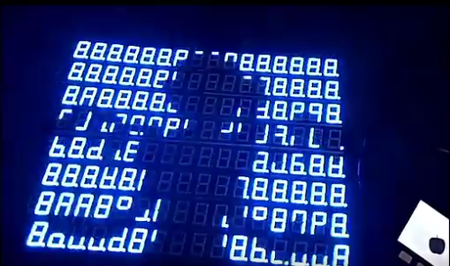
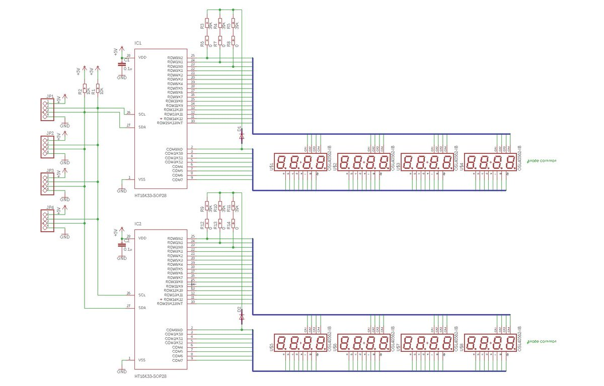
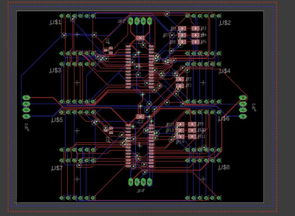
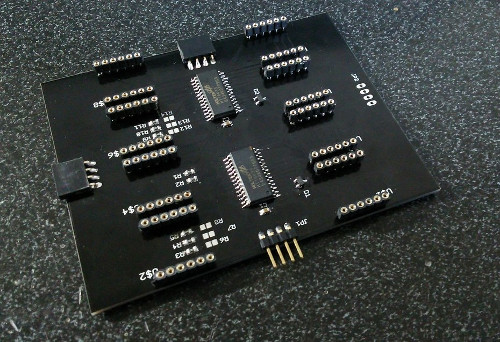
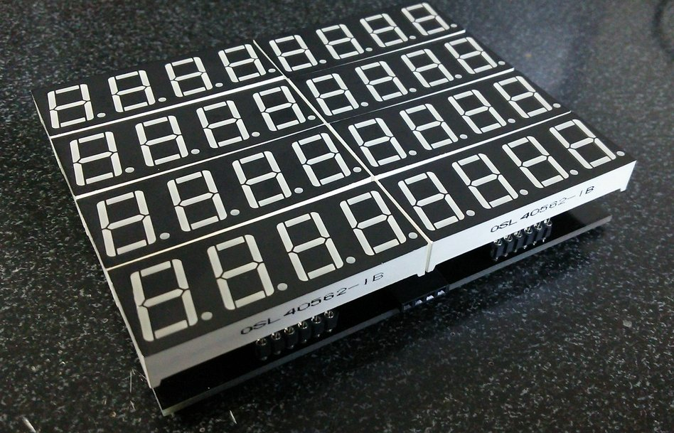

# M5Stack_7SegMovie

- [Movie](https://twitter.com/Tw_Mhage/status/1004363276761772032)

## Prepare
- [M5Stack](https://www.switch-science.com/catalog/3647/)  Main board : Switch Science
- [HT16K33-SOP28](http://www.aitendo.com/product/9850)  LED Controller Driver : Aitendo
- [OSL40562-IB] : 0.56 Inch Four Digit Display. Common Anode type.

## Handmade Board

 
 
- Board× 4 : Elecrow and so on.
- [gerber](doc/gerber.zip) gerber data for manufacturing PCB 

## Create data of 7SegMovie
You can make from 160x120 bitmap file series. See Create7SegMovieData/Program.cs.

## Development Environment
- [Arduino IDE](https://www.arduino.cc/en/main/software)
- [arduino-esp32](https://github.com/espressif/arduino-esp32)
