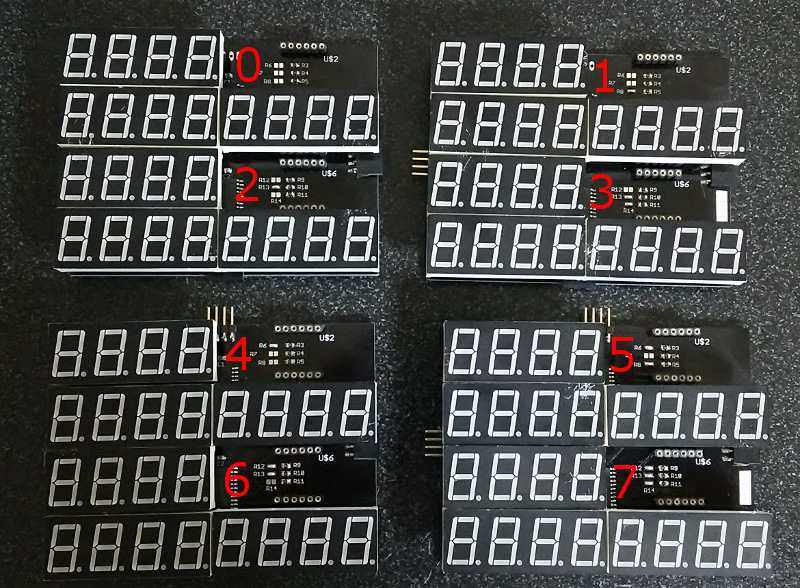
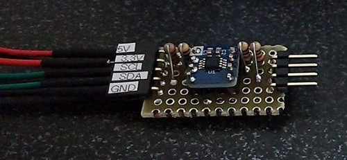
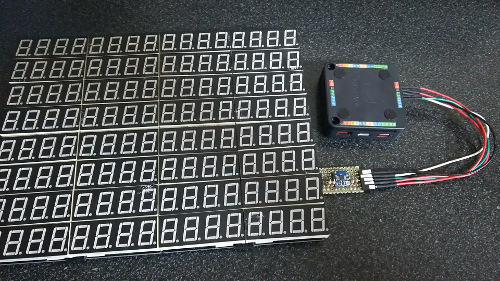

# M5Stack_7SegMovie

- [Movie](https://twitter.com/Tw_Mhage/status/1004363276761772032)

## Prepare
- [M5Stack](https://www.switch-science.com/catalog/3647/)  Main board : Switch Science
- [HT16K33-SOP28](http://www.aitendo.com/product/9850)  LED Controller Driver : Aitendo
- [OSL40562-IB] : 0.56 Inch Four Digit Display. Common Anode type.
- [I2C level conversion board](https://www.switch-science.com/catalog/2375/) signal level 3.3V to 5V: Switch Scicence

## Handmade Board

 
 
- use 4 Handmade Boards. A board has 2 LED Controller Driver and controls 8 Four Digit Displays.
- [gerber](doc/gerber.zip) : Data for manufacturing PCB. Format for [Elecrow](https://www.elecrow.com/pcb-manufacturing.html) and so on.
- The drivers are distinguished by jumper pad (R6, R7, R8, R12, R13, R14).
- 
- 3.3V signal level for M5Stack has to be converted to 5V for LED Controller Driver.
- 
- 

## Create data of 7SegMovie
You can make from 160x120 black-and-white bitmap file series. See Create7SegMovieData/Program.cs.

## Development Environment
- [Arduino IDE](https://www.arduino.cc/en/main/software)
- [arduino-esp32](https://github.com/espressif/arduino-esp32)

## Original
- http://www.nicovideo.jp/watch/sm8628149
- http://www.nicovideo.jp/watch/sm27598174
